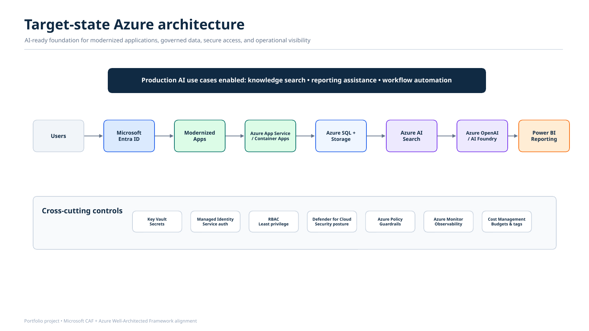
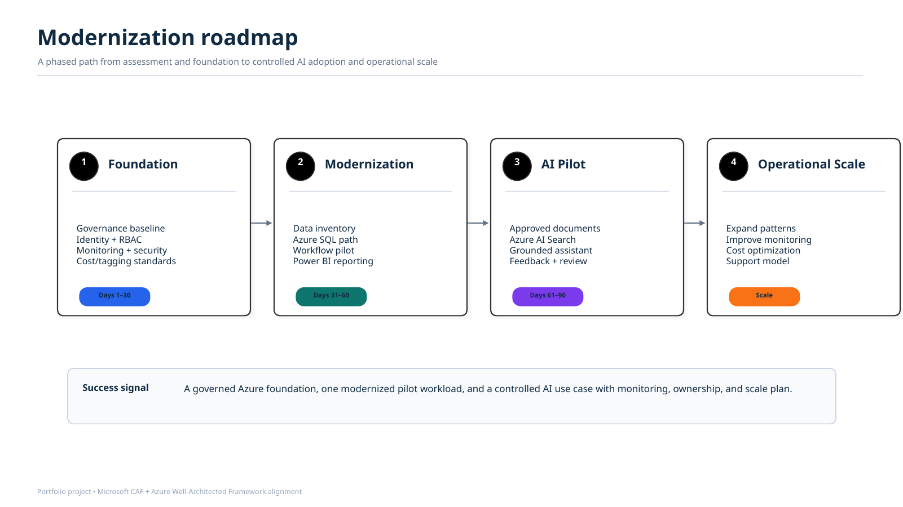

# Azure AI-Ready Cloud Modernization Engagement

## Overview

This project simulates a Cloud Solution Architect engagement for a fictional regulated organization preparing to modernize its cloud environment and adopt production-ready AI workloads on Microsoft Azure.

The project uses Microsoft Cloud Adoption Framework (CAF) and Azure Well-Architected Framework (WAF) concepts to move from current-state assessment to target-state architecture, modernization roadmap, risk identification, governance planning, and production-readiness recommendations.

## Customer Scenario

Contoso Operations is a regulated, operations-heavy organization using a mix of legacy SQL Server, shared drives, Excel reporting, SharePoint lists, and manual approval workflows.

Leadership wants to adopt Azure AI for internal knowledge search, reporting assistance, and workflow automation. However, the current environment lacks the secure, scalable, resilient, and observable cloud foundation needed to support production AI workloads.

## Business Problem

The organization wants to adopt AI, but several blockers exist:

- Legacy data sources are fragmented across SQL Server, file shares, Excel, and SharePoint.
- Manual workflows slow down operations and create inconsistent handoffs.
- There is no clear cloud adoption roadmap.
- Monitoring and alerting are inconsistent.
- Identity, access, and secrets management need modernization.
- Reporting is reactive instead of operationally integrated.
- AI workloads need a production-ready foundation before scaling.

## Engagement Goals

The goal of this simulated engagement is to design an Azure modernization roadmap that helps the customer:

- Modernize legacy applications and data sources.
- Establish a secure Azure foundation.
- Prepare for production-ready AI workloads.
- Improve monitoring, resiliency, and operational excellence.
- Apply governance and cost controls.
- Create a phased roadmap for adoption.

## Target-State Architecture


The proposed target state includes:

- Microsoft Entra ID for identity and access management
- Azure App Service or Azure Container Apps for modern application hosting
- Azure SQL Database for relational data modernization
- Azure Storage for document and file storage
- Azure AI Search for knowledge retrieval
- Azure OpenAI / Azure AI Foundry for AI-assisted workflows
- Azure Key Vault for secrets management
- Managed identities for secure service-to-service authentication
- Azure Monitor and Application Insights for observability
- Microsoft Defender for Cloud for security posture management
- Power BI for executive reporting and operational insights

## Microsoft Framework Alignment

This project is organized around Microsoft architecture guidance.

### Cloud Adoption Framework Alignment

- Strategy: Define business outcomes and adoption drivers.
- Plan: Create a phased modernization roadmap.
- Ready: Establish landing zone, governance, and operational readiness.
- Adopt: Modernize applications, data, and workflows.
- Govern: Apply policy, RBAC, cost controls, and data governance.
- Manage: Monitor workloads, define support model, and manage operations.
- Secure: Protect identity, data, applications, and infrastructure.

### Azure Well-Architected Framework Alignment

- Reliability
- Security
- Cost Optimization
- Operational Excellence
- Performance Efficiency
- 
## Migration Roadmap


## Deliverables

This repository includes:

- Customer scenario and current-state assessment
- Cloud readiness assessment
- Usage-versus-needs analysis
- CAF alignment documentation
- Well-Architected review
- Target-state architecture
- Migration and modernization roadmap
- Security and governance plan
- Production-readiness checklist
- Executive summary

## Repository Structure

```text
customer-scenario/
caf-alignment/
well-architected-review/
assessment/
architecture/
implementation-roadmap/
security-governance/
executive-brief/
